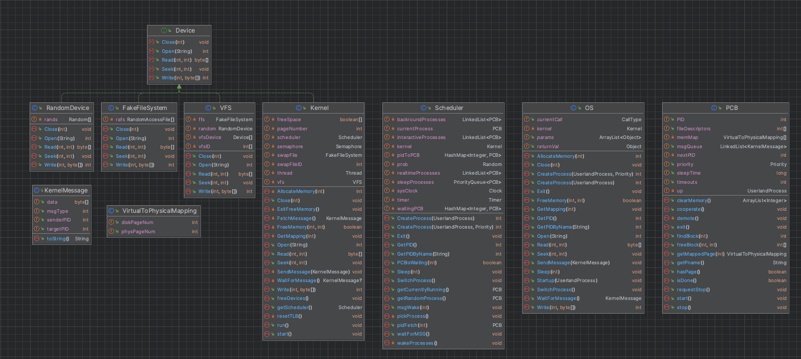

# ShankOS
## What is it?
ShankOS is a Operating System emulator built in java, in which the actions of a cooperatively multitasked operating system are simulated.

Each UserlandProcess is given its own jvm thread to run in, however, processes do NOT run concurrently. The Kernel and the Scheduler are responsible for picking and running a given process from the queue of processes available to run. 

Each UP is required to cooperate (call its own cooperate() method) at some point during its runtime.

A number of UserlandProcesses have been included in the repository to showcase a majority of the OS's functionality

A user can also specify their own processes by creating a class extending UserlandProcess and writing their code into the classes main method.

## OS CALLS
A number of Operating System calls are available to the user:
- CreateProcess() : used to spawn a new UserlandProcess and add it to the queue of running processes. Optionally, a priority may be passed in (RealTime, Interactive, Backround)
- Sleep() : takes in a value for milliseconds and sleeps this process for the specified value
- Open() : open the new specified device
- Close() : close the specified device
- Read() : read output from the specified device
- Seek() : seek to a specified point in the device
- Write() : write to the specified device
- Exit() : kill this process
- GetPID() : get the PID for this process
- GetPIDByName() : get the PID for the process specified by name
- SendMessage() : send a message to another process
- WaitForMessage() : block this process until a message is recieved
- AllocateMemory() : allocate a chunk of memory of a specified size for this process
- FreeMemory() : free a chunk of specified memory from this process
---



---

## Running the simulation

to run the simulation, ensure that maven is installed. Then, navigate to the projects directory and execute the maven goal:

```bash
mvn clean compile exec:java
```

